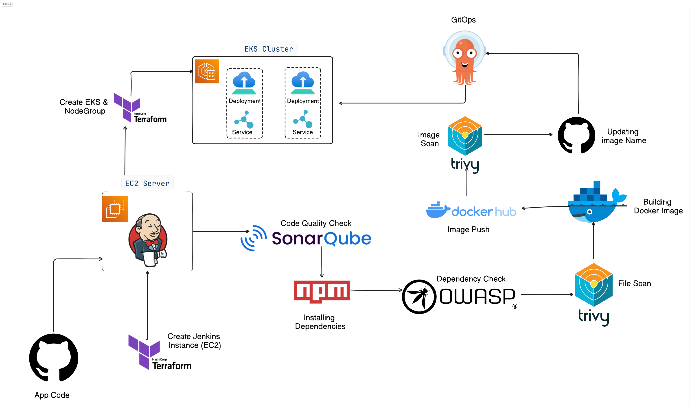

# DevSecOps Tetris Project


[](https://www.linkedin.com/in/yehezkiel-rumapea-08a1b8391)
[](https://github.com/YehezkielRumapea)


---

**This project is an end-to-end DevSecOps pipeline implementation for deploying a React-based Tetris application to the AWS cloud environment. It demonstrates how an application can be built, security-tested, and automatically deployed to a Kubernetes cluster with infrastructure entirely managed as code.**

---



---

## Getting Started

### Prerequisites

Make sure the following tools are installed and configured before getting started:

- [AWS CLI](https://docs.aws.amazon.com/cli/latest/userguide/install-cliv2.html) — configured with valid credentials
- [Terraform](https://developer.hashicorp.com/terraform/install) >= 1.0
- [kubectl](https://kubernetes.io/docs/tasks/tools/)
- [Docker](https://docs.docker.com/get-docker/)
- AWS Account with sufficient permissions (EC2, EKS, IAM, S3, VPC)

---

### 1. Clone Repository

```bash
git clone https://github.com/YehezkielRumapea/DevSecOps-Tetris-Project.git
cd DevSecOps-Tetris-Project
```

---

### 2. Setup Infrastructure (Terraform)

#### Create S3 Bucket for Terraform State
```bash
cd Bootstrap
terraform init
terraform apply --auto-approve
```

#### Provision Jenkins & SonarQube Server
```bash
cd Jenkins-Server
terraform init
terraform apply -var-file=variables.tfvars --auto-approve
```

#### Provision EKS Cluster

Run the **Jenkins-Eks** pipeline in Jenkins:
1. Open Jenkins → **Jenkins-Eks** pipeline
2. Click **Build with Parameters**
3. Select `Terraform-Action` → `apply`
4. Click **Build**

---

### 3. Setup Jenkins Pipeline

1. Open Jenkins at `http://<Your-Jenkins-IP>:8080`
2. Install required plugins:
   - NodeJS
   - SonarQube Scanner
   - OWASP Dependency Check
   - Docker
   - AWS Credentials
   - rebuilder
   - graph
3. Configure credentials:
   - `docker` — `<Your-DockerHub-Username>` & `<Your-DockerHub-Password>`
   - `github` — `<Your-GitHub-Personal-Access-Token>` (Secret text)
   - `aws-credentials` — `<Your-AWS-Access-Key>` & `<Your-AWS-Secret-Key>`
   - `sonar-secret-token` — `<Your-SonarQube-Token>`
4. Create new Pipeline:
   - Definition: **Pipeline script from SCM**
   - SCM: **Git**
   - Repository URL: `https://github.com/<Your-GitHub-Username>/<Your-Repo-Name>.git`
   - Branch: `*/main`
   - Script Path: `Jenkins/Tetris.jenkinsfile`

---

### 4. Setup ArgoCD

#### Install ArgoCD
```bash
kubectl create namespace argocd
kubectl apply -n argocd -f https://raw.githubusercontent.com/argoproj/argo-cd/stable/manifests/install.yaml
```

#### Access ArgoCD UI
```bash
kubectl patch svc argocd-server -n argocd -p '{"spec": {"type": "LoadBalancer"}}'
kubectl get svc argocd-server -n argocd
```

#### Get Initial Password
```bash
kubectl get secret argocd-initial-admin-secret -n argocd \
  -o jsonpath="{.data.password}" | base64 -d
```

#### Create Application in ArgoCD
- **Application Name:** `tetris`
- **Project:** `default`
- **Sync Policy:** `Automatic`
- **Repository URL:** `https://github.com/YehezkielRumapea/DevSecOps-Tetris-Project.git`
- **Path:** `Manifest`
- **Cluster:** `https://kubernetes.default.svc`
- **Namespace:** `default`

---

### 5. Run the Pipeline

1. Open Jenkins → **Tetris** pipeline
2. Click **Build with Parameters**
3. Select `APP_VERSION` → `v1` or `v2`
4. Click **Build**

Pipeline will automatically:
- Scan code with SonarQube
- Check dependencies with OWASP
- Scan filesystem and image with Trivy
- Build and push Docker image to Docker Hub
- Update `Manifest/Deployment.yaml` with new image tag
- ArgoCD detects changes and deploys to EKS

---

### 6. Access the Application

```bash
kubectl get svc tetris-service -n default
```

Open the `EXTERNAL-IP` in your browser:
```
http://<EXTERNAL-IP>
```

---

## License

This project is licensed under the [MIT License](LICENSE).
